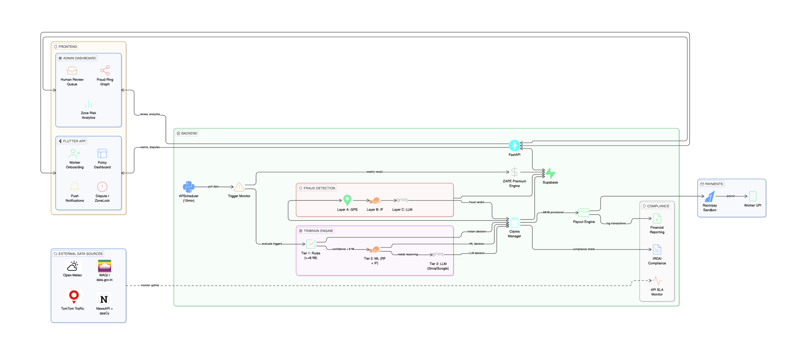

# SaatDin

> *Ek hafte ki kamai, hamesha surakshit.*
> A week's earnings, always protected.

Parametric income insurance for Q-commerce delivery riders in Bangalore — automatic payouts when external disruptions make work impossible.

---

## What It Does

Riders pay a small weekly premium. When rainfall, air quality, traffic, curfews, or extreme heat disrupt their delivery zone, SaatDin detects the event via real-time APIs and credits a payout to their UPI account **automatically** — no claim form, no phone call, no waiting.

**Triggers are evaluated at pincode level.** A flood in Bellandur does not trigger a payout for a rider in Whitefield.



---

## What's Implemented

- **Flutter Android app** — onboarding, policy, claims, payouts
- **FastAPI application API** — OTP auth, premium calculation, trigger monitoring (15-min polling), claims, escalations, admin dashboard
- **Spring Boot billing service** — idempotent payment orders, verified provider webhooks, an immutable payment ledger, and authoritative weekly coverage
- **Five parametric triggers** — RainLock, AQI Guard, TrafficBlock, ZoneLock, HeatBlock
- **Multi-signal fraud detection** — GPS variance, cell tower validation, motion analysis, device fingerprinting, co-claim graphs
- **Archival design** — S3-compatible cold storage and BigQuery are planned, not yet implemented
- **Manual escalation** — 60% immediate payout + human review for ambiguous cases

**For full architecture, fraud defense strategy, and design philosophy, see [PROJECT_INFO.md](PROJECT_INFO.md).**

---

## Planned Archival Storage

The intended production design keeps **current-week data + rolling 4-week history** in Supabase/Postgres, then archives closed weeks to S3-compatible storage and BigQuery. The current repository does not yet contain that archival job or retention enforcement.

This keeps reads sub-100ms while building the historical record needed for pricing calibration as real claims accumulate.

---

## Quick Start

```bash
python -m pip install -r backend/requirements.txt
# Copy backend/.env.example and billing-service/.env.example into your local
# environment, use the same internal API key, and configure PostgreSQL.
cd billing-service && ./mvnw spring-boot:run
# In another terminal, from the repository root:
python -m uvicorn backend.app.main:app --host 127.0.0.1 --port 8000
# In another terminal:
flutter run --dart-define=API_BASE_URL=http://10.0.2.2:8000/api/v1
```

Admin dashboard: `http://127.0.0.1:8000/admin/dashboard` (admin / saatdin-local)

Billing health: `http://127.0.0.1:8082/actuator/health`

Full setup: [Setup Guide](setup%20guide.md)

---

## Tech Stack

Application API: Python 3.11, FastAPI, APScheduler | Billing: Java 17, Spring Boot, Flyway | Data: Supabase/Postgres with separate application and `billing` schemas | ML: scikit-learn, LangGraph, Groq | Mobile: Flutter | Payments: local sandbox adapter | CI: GitHub Actions

---

## Documentation

- **[PROJECT_INFO.md](PROJECT_INFO.md)** — Architecture, triggers, fraud defense, design philosophy
- **[Setup Guide](setup%20guide.md)** — Local dev and deployment


---

## Team

T Vishnu Vardhan · D Rohith Kumar · V A B Jashwanth Reddy · V Kireeti · Tejesh Neelam

---

*Pre-production software. Premium collection is end-to-end only through the local sandbox provider. A live payment adapter, live SMS, payout-provider callbacks, archival, monitoring, and actuarial/regulatory approval remain required before real-world deployment.*
